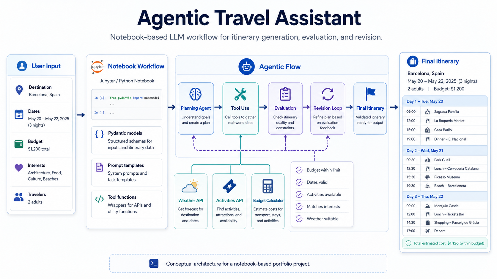
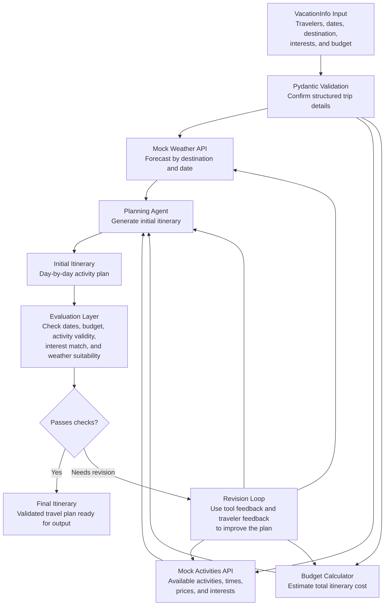

# Agentic Travel Assistant

LLM-powered travel assistant built during Udacity’s Agentic AI Nanodegree and adapted into a polished portfolio project showcasing agentic AI workflows.



This workflow uses mocked weather and activity APIs to simulate external tool calls.

## What it does

This project generates and revises a personalized itinerary for a fictional trip to **AgentsVille**. The assistant uses traveler preferences, budget, mock weather data, and mock activity availability to create a day-by-day travel plan, then revises the plan based on feedback.

## Architecture

This project follows a simple agentic workflow: collect structured trip details, use tools to gather mocked travel data, generate an itinerary, evaluate it against constraints, and revise it based on feedback.



The weather and activity data in this project are mocked APIs, which lets the notebook demonstrate tool use, evaluation, and itinerary revision without depending on live third-party services.

## Why I built it

I used this project to practice core agentic AI concepts in a contained, reviewable workflow:

- role-based prompting for a specialized itinerary-planning agent
- structured inputs and outputs with Pydantic models
- mocked API calls for weather and activity data
- evaluation functions for budget, date validity, activity validity, interest matching, and weather compatibility
- a ReAct-style revision loop using tools for calculation, activity lookup, and evaluation

## Project flow

1. Define vacation details: travelers, interests, dates, destination, and budget.
2. Validate the vacation object with Pydantic.
3. Retrieve mocked weather and activity data for the trip dates.
4. Generate an initial itinerary with an LLM planning agent.
5. Run deterministic and LLM-assisted evaluations.
6. Incorporate traveler feedback with a tool-using revision agent.
7. Validate and display the final itinerary.

## Repository structure

```text
agentic-travel-assistant/
├── notebooks/
│   └── agentic_travel_assistant.ipynb
├── demo-output/
│   └── sample_final_itinerary.md
├── docs/
│   └── product_notes.md
├── project_lib.py
├── requirements.txt
├── .env.example
└── .gitignore
```

## How to run locally

```bash
git clone https://github.com/YOUR-USERNAME/agentic-travel-assistant.git
cd agentic-travel-assistant
python3 -m venv .venv
source .venv/bin/activate
pip install -r requirements.txt
cp .env.example .env
```

Then add your own API key to `.env`:

```bash
OPENAI_API_KEY=your_api_key_here
```

Open the notebook:

```bash
jupyter notebook notebooks/agentic_travel_assistant.ipynb
```

## Demo output

A representative final itinerary is included in [`demo-output/sample_final_itinerary.md`](demo-output/sample_final_itinerary.md).

## Product lens

If this were a real travel-planning product, I would measure success by:

- time to generate a useful itinerary
- number of clarification turns needed
- accuracy of hard constraints like budget, dates, and activity availability
- quality of preference matching across multiple travelers
- user confidence in the final plan

Potential next iterations:

- connect to real weather, maps, calendar, and events APIs
- add budget-aware filtering before LLM planning
- add richer evaluations for pacing, travel time, accessibility, and family-friendliness
- add a simple UI for collecting traveler preferences
- replace verbose reasoning traces with concise user-facing rationales

## Attribution

Completed as part of Udacity’s Agentic AI Nanodegree. The portfolio version was cleaned, documented, and adapted by Nimra Alam. Starter utilities and mocked APIs are attributed to Udacity and included only to make the notebook reviewable and runnable.

